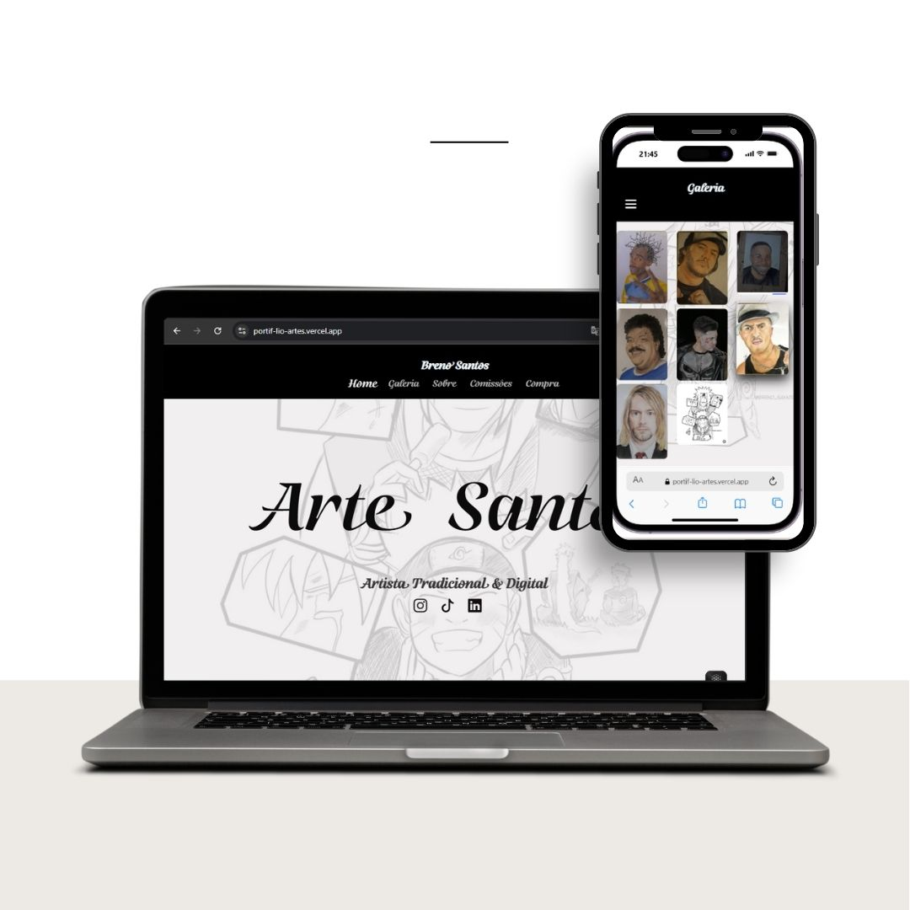

🎨 Portfólio artístico desenvolvido com React, Styled Components e React Router. O projeto apresenta uma galeria de artes digitais e tradicionais,
animações suaves, design responsivo e navegação dinâmica entre páginas.

## 💻 Desktop

<<<<<<< HEAD

=======
>>>>>>> 68b569d76b6afa38b0bc626da5d92bff63669c02

🔗 Projeto Online: https://portif-lio-artes.vercel.app/
